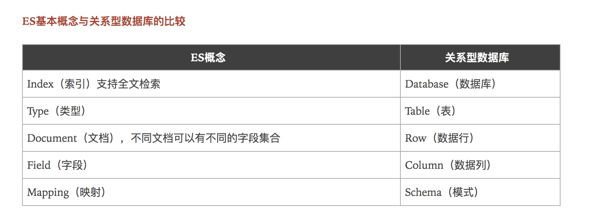

> ES version:7.10.2

##### ES基本概念与关系型数据库的比较 

```text
索引：就是数据库
类型：字段类型(mapping)
文档：就是一条条数据
分片：Lucene倒排索引
```

##### Lucene 和 Es 关系
- ES 是基于Lucene做了一层封存和增强
```text
ES： 全文搜索，结构化搜索，分析
Solr:  数据量越大， 搜索效率越低
Lucene:
```

##### Go链接Docker ES 报错
```text
golang 使用 github.com/olivere/elastic 包进行连接 远程 es 或者docker搭建的es时(只要golang所在主机与es所在主机不同)，报错信息如下
- es client connect failed:no active connection found: no Elasticsearch node available

解决方法(两种)
1,改变golang代码初始化client时的 参数.  
client, err := elastic.NewClient(elastic.SetSniff(false),elastic.SetURL(host…))  
新增参数 elastic.SetSniff(false), 用于关闭 Sniff

2,调整es node 的 publish_address 配置，
新增 network.publish_host: 127.0.0.1, 整体配置文件如下:
[root@e33229400bf1 config]# cat elasticsearch.yml
cluster.name: "docker-cluster"
network.host: 0.0.0.0
network.publish_host: 127.0.0.1 # 新增配置项

```

##### IK分词器

- 安装： https://github.com/medcl/elasticsearch-analysis-ik/tree/v7.10.2
```shell
elasticsearch-plugin install https://github.com/medcl/elasticsearch-analysis-ik/releases/download/v7.10.2/elasticsearch-analysis-ik-7.10.2.zip
```

##### 基本操作 ， 复杂操作搜索 select （排序，分页，高亮）
```text
PUT /test1/type1/2
{
  "name":"xxxxxx",
  "age": 4
}

PUT /test2
{
  "mappings": {
    "properties": {
      "name" :{
        "type": "text"
      },
      "age" : {
        "type":"long"
      },
      "birthday": {
        "type": "date"
      }
    }
  }
}

GET test2

PUT /test3/_doc/4
{
  "name" : "bafdasf",
  "age" : 56,
  "birth": "abadf"
}

#修改 推荐
POST /test3/_doc/1/_update 
{
  "doc" : {
    "name":"xxxxx"
  }
}

GET test3


GET _cat/indices?v


DELETE test1

GET test3/_doc/_search?q=name:xxx

GET test3/_doc/_search
{
  "query" : {
    "match" : {
      "name" : "xxx"
    }
  },
  "_source": ["name", "age"],
  "sort":{
    "age" : {
      "order": "asc"
    }
  },
  "from" : 0,
  "size": 3
}

# _source: 显示的搜索字段
# sort : 排序
# 分页： from(从几个数据开始), size(返回多少条数据), 相当于mysql里的limit offset (from), num(size)

# 多条件， 
# must =>  and
GET test3/_doc/_search
{
  "query" : {
    "bool" : {
      "must" : [
        {
          "match":{
            "name": "bafdasf"
          }
        }, 
        {
          "match":{
            "age": "56"
          }
        }
      ]
    }
  }
}

# should => or
GET test3/_doc/_search
{
  "query" : {
    "bool" : {
      "should" : [
        {
          "match":{
            "name": "bafdasf"
          }
        }, 
        {
          "match":{
            "age": "23"
          }
        }
      ]
    }
  }
}


# must_not => not
GET test3/_doc/_search
{
  "query" : {
    "bool" : {
      "must_not" : [
        {
          "match":{
            "name": "bafdasf"
          }
        }
      ]
    }
  }
}


# 过滤 filter, 增加一些过滤的条件
GET test3/_doc/_search
{
  "query" : {
    "bool" : {
      "must" : [
        {
          "match":{
            "name": "bafdasf"
          }
        }
      ],
      "filter" : {
        "range":{
          "age" : {
            "lt": 10
          }
        }
      }
    }
  }
}

```