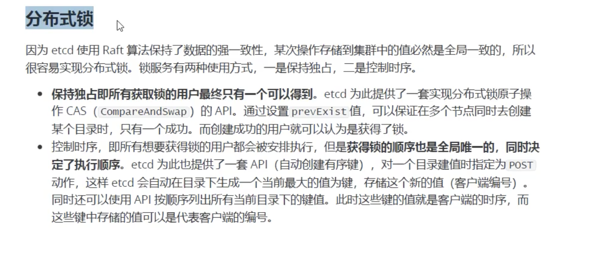

###ETCD背后的Raft一致性算法原理
- https://www.jianshu.com/p/5aed73b288f7

### watch底层实现原理
- https://www.lixueduan.com/post/etcd/05-watch/

### etcdctl一些操作命令 ， 去了解！

### 图示
- 
- 
- 
- 
- 
- 
- 
- 
- 
- 
- 

#### 分布式锁
- https://zhuanlan.zhihu.com/p/42056183