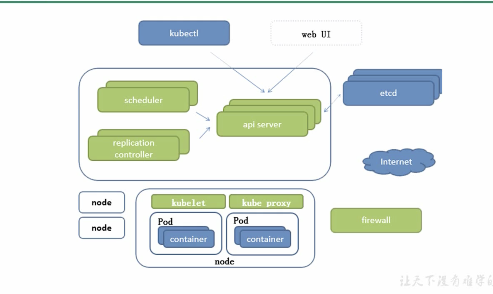

> Kubernetes教程学习
#### 视频链接：https://www.bilibili.com/video/BV1w4411y7Go
```text
链接：https://pan.baidu.com/s/1vGOlt5KH_67qU2e3A7f6bQ 
提取码：9cmp

Kubernetes 特点
    轻量级，消耗资源小
    开源
    弹性伸缩
    负载均衡：IPVS

掌握：
资源清单：   资源/资源清单语法/编写pod/掌握pod的生命周期/
pod控制器： 掌握各种控制器的特点以及使用定义方式
服务发现：   掌握SVC 原来及其构建方式
存储： 掌握多种存储类型的特点，并且能够在不同环境中选择合适的存储方案（有自己的简介）
调度器： 掌握调度器原理，能够根据要求把pod定义到想要的节点运行
安全： 集群的认证，鉴权， 访问控制原理及其流程
HELM: Linux yum 掌握HELM 原理 / HELM 模版自定义  HEML 部署一些常用的插件
运维： 修改kubeadm 达到证书可用期限， 能够构建高可用的kubernetes 集群


服务分类：
    有状态服务：DBMS
    无状态服务：LVS APACHE 

高可用集群副本数据最好是 2n+1 (n>=1) 

APISERVER: 所有服务访问统一入口
CrontrollerManager : 维持副本期望数目
Scheduler： 负责介绍任务，选择合适的节点进行分配任务
ETCD: 键值对数据库，存储K8S集群所有重要信息（持久化）
Kubelet:直接跟容器引擎交互实现容器的生命周期管理
Kube-proxy: 负责写入规则至iptables,Ipvs实现服务映射访问
CoreDNS： 可以为集群中的SVC创建一个域名IP的对应关系解析
Bashboard： 给K8s 集群提供一个B/s结构访问体系
INGRESS CONTROLLER： 官方只能实现四层代理，INGRESS 可实现七层代理
FEDETATION : 提供一个可以跨集群中心多K8S统一管理功能
PROMETHEUS: 提供k8s集群的健康能力
ELK: 提供K8s 集群日志统一分析平台


ETCD 的官方将它定位成一个可信赖的分布式键值存储服务，它能够为整个分布式集群存储一些
关键数据，协助分布式集群的正常运转

```

##### k8s 架构图
