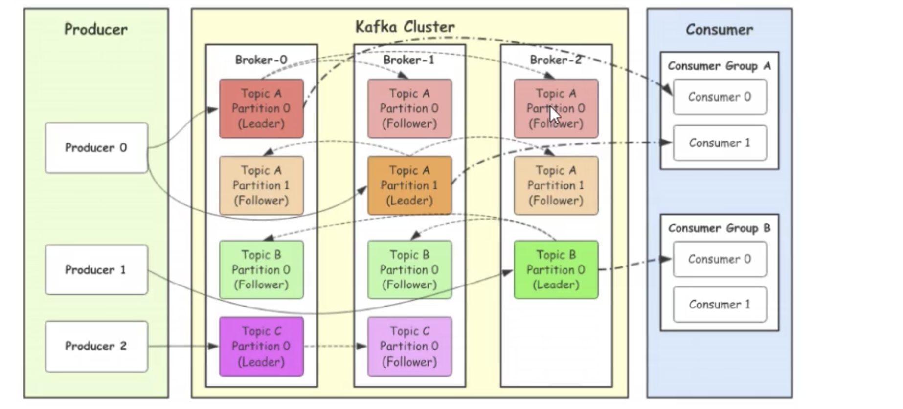
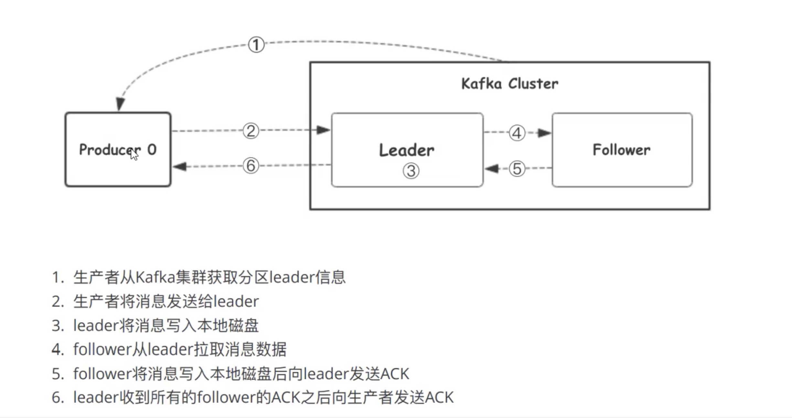
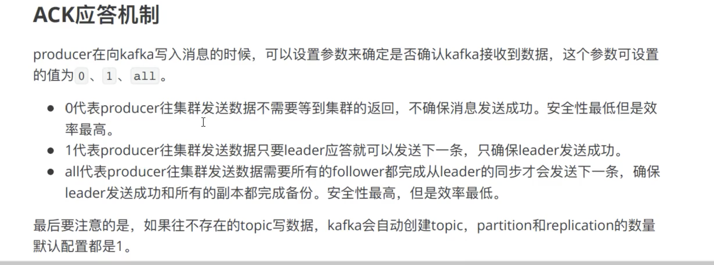
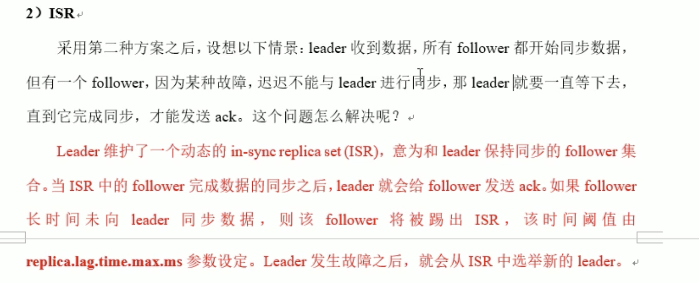
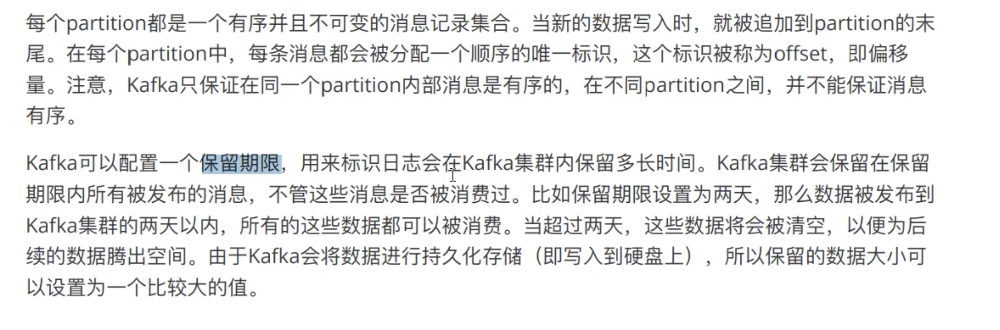
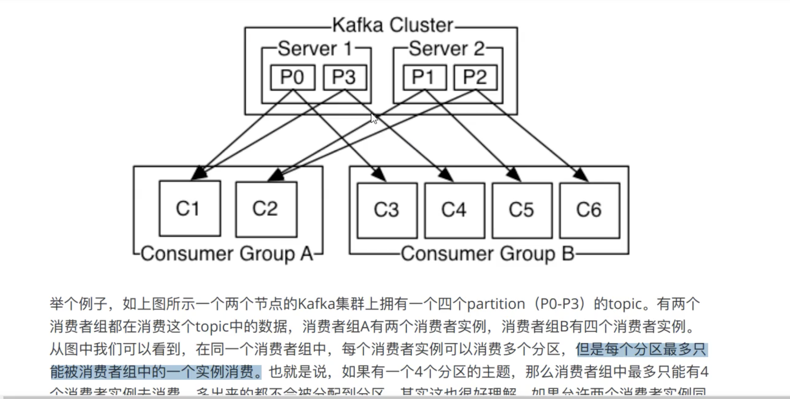
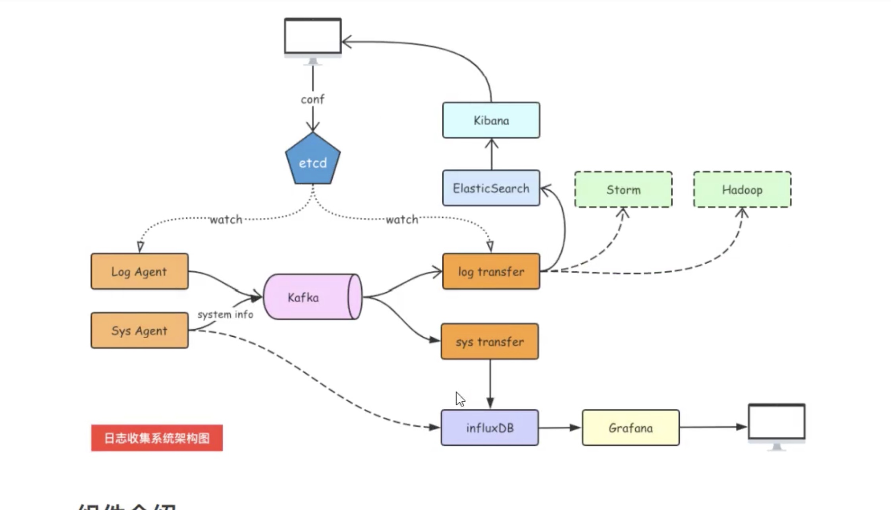

> Kafka 
- 官网： http://kafka.apachecn.org/

#### kafaka
- 1.kafka 集群的架构
    
    -  1.broker （相当于服务器）
    -  2.topic  （主题）
    -  3.partition:分区，把同一个topic分成多个分区，集群中扩展,提高负载 / 提高并发，读写速度
        -  3.1.leader:分区的主节点
        -  3.2.follower:分区的从节点（leader 副本）
    -  4.Consumer Group （消费组）
        - 某一个topic下分区数据，只能被消费者组里面的一个消费者消费
    
- 2.生产者往kafka发送数据的流程（六步）
    
    
- 3.kafka选择分区的模式（3种）
    
    -   3.1 指定往哪个分区写
    -   3.2 指定key, kafka 根据key做hash然后决定写哪个分区
    -   3.3 轮询分时

- 4.生产者往kafka发送数据的模式（3种）
    
    - 0：把数据发送给leader就成功 ，效率最高，安全性最低
    - 1：把数据发送给leader,等待leader回ACK
    - all： 把数据发送给leader,确保follower从leader拉去数据回复ack给leader，leader在回复ack，安全性高
```text
ISR 概念
Leader 维护了一个动态的 in-sync replica set (ISR)，意为和 leader 保持同步的 follower 集合。
当 ISR 中的 follower 完成数据的同步之后，就会给 leader 发送 ack。如果 follower长时间未向leader同步数据，
则该follower将被踢出ISR，该时间阈值由replica.lag.time.max.ms参数设定。 Leader 发生故障之后，就会从 ISR 中选举新的 leader。

all全部优化 , ISR: 同步副本

- 等于all 的时候 
也会丢失数据 原因是ISR 只有一个leader,这种情况很少
也会重复数据，follower 同步完成时候，leader挂了， product没有收到ack, 此时其中一个follower
变为leader， product重新发送数据给leader, 就会出现重复
```


- 5.分区存储文件原理
    

- 6.为什么kafka快？ (随机度换为了顺序读， 记录了索引位置)

- 7.消费者组消费数据的原理
    

- 8.日志收集系统架构图
    
    
- 9.offset 在0.9版本之前存在zk, 0.9版本之后存在kafka本地，存在磁盘

- 10.分片和索引 .log放数据，.index放索引
```text
先index文件中， 二分查找到offset , 根据偏移量查找数据的位置和大小，在到log中找数据
```

### 如何数据一致性
```text
HW:high watermark 所有副本中最小的LEO, 指消费者能见到最大的offset， ISR队列中最小的LEO
LEO: log end offset, 每个分区，  每个副本的最后一个offset

消费者 只消费到ISR队列中最小的LEO, 所有副本中offset 最小的一条数据 

注：这只能保证副本之间数据一致性， 并不能保证数据不丢失或者不重复
```

### Exactly once 语以
```text
ack = 0 , 会丢数据， 不重复
ack = 1 , 会丢数据
ack = -1 , isr = 1 会丢数据， isr >= 2 保证数据不丢失， 可能会重复

幂等性 + at least once = exactly once
幂等性 0.1版本后， 解决数据重复问题 
启用幂等性 product 参数中 enable.idompotence = true , ack 默认为 -1  ，只能保证单
会话 幂等， 没办法跨分区／会话的做到幂等
```

### Kafka 消费者
```text
pull / push 

分区分配策略
一个 consumer group 中有多个 consumer，一个 topic 有多个 partition，
所以必然会涉及到 partition 的分配问题，即确定那个 partition 由哪个 consumer 来消费。

Kafka 有两种分配策略：
round-robin循环，按组来划分的 / range(默认)，按主题来划分的
当消费组中消费数量变化，会重新触发分区分配策略
```

#### offset 的维护
```text
ZK 保存offset : 消费者组(group)， 主题(topic)， 分区（partition） 三者来确定offset

Kafka 0.9 版本之前， consumer 默认将 offset 保存在 Zookeeper 中，
从 0.9 版本开始，consumer 默认将 offset 保存在 Kafka 一个内置的 topic 中，
该 topic 为__consumer_offsets。

$bin/kafka-topics.sh --create --topic bigdata --zookeeper host:port --patitions 2 --replication-facter 2

$bin/kafka-console-producer.sh --broker-list host:port --topic bigdata
$bin/kafka-console-consumer.sh --zookerper host:port --topic bigdata

```

#### kafka 高效读写
```text
0，分布式分区，并发读写
1，顺序写磁盘， 顺序写之所以快， 是因为省去了大量磁头寻址的时间 
2，零复制技术
```

#### Zookeeper 在 Kafka 中的作用
```text
Kafka 集群中有一个 broker 会被选举为 Controller，负责管理集群 broker 的上下线，
所有 topic 的分区副本分配和 leader 选举等工作。Reference Controller 的管理工作都是依赖于 Zookeeper 的。

以下为 partition 的 leader 选举过程：
```
(Leader 的选举)
 
 
#### kafka 事务
```text
生产者事务
0.11 版本开始引入事务 （跨分区跨会话实现幂等性，精准一次性写入到集群）
为了实现跨分区跨会话的事务，需要引入一个全局唯一的 Transaction ID，并将 Producer 获得的PID 
和Transaction ID 绑定。这样当Producer 重启后就可以通过正在进行的 TransactionID 获得原来
的 PID。
为了管理 Transaction， Kafka 引入了一个新的组件 Transaction Coordinator。 Producer 就是通过和
Transaction Coordinator 交互获得 Transaction ID 对应的任务状态。 Transaction Coordinator 还负责将事务
所有写入 Kafka 的一个内部 Topic，这样即使整个服务重启，由于事务状态得到保存，进行中的事务状态可以
得到恢复，从而继续进行。

消费者事务

```
#### Kafka API

```text
Kafka 的 Producer 发送消息采用的是异步发送的方式

涉及到了两个线程——main 线程和 Sender 线程 ，以及一个线程共享变量——RecordAccumulator
main 线程将消息发送给 RecordAccumulator， Sender 线程不断从 RecordAccumulator 中拉取消息发送到 Kafka broker。

相关参数：
batch.size： 只有数据积累到 batch.size 之后， sender 才会发送数据。
linger.ms： 如果数据迟迟未达到 batch.size， sender 等待 linger.time 之后就会发送数据。

```


#### docker-composer
- https://github.com/simplesteph/kafka-stack-docker-compose

#### 参考文献
 https://blog.csdn.net/miss1181248983/article/details/90724870
 https://blog.csdn.net/valada/article/details/80892612