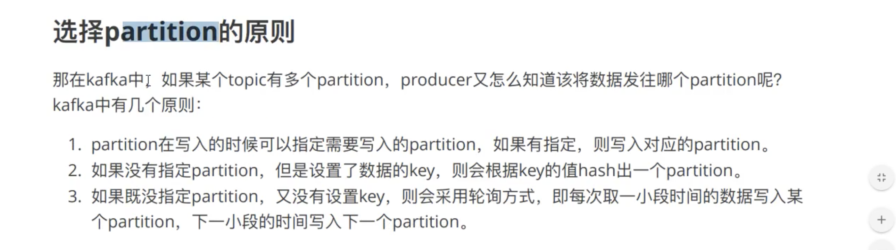

#### kafaka
- 1.kafka 集群的架构
    
    -  1.broker （相当于服务器）
    -  2.topic  （主题）
    -  3.partition:分区，把同一个topic分成多个分区，集群中扩展,提高负载 / 提高并发，读写速度
        -  3.1.leader:分区的主节点
        -  3.2.follower:分区的从节点（leader 副本）
    -  4.Consumer Group （消费组）
        - 某一个topic下分区数据，只能被消费者组里面的一个消费者消费
    
- 2.生产者往kafka发送数据的流程（六步）
    
    
- 3.kafka选择分区的模式（3种）
    
    -   3.1 指定往哪个分区写
    -   3.2 指定key, kafka 根据key做hash然后决定写哪个分区
    -   3.3 轮询分时

- 4.生产者往kafka发送数据的模式（3种）
    
    - 0：把数据发送给leader就成功 ，效率最高，安全性最低
    - 1：把数据发送给leader,等待leader回ACK
    - all： 把数据发送给leader,确保follower从leader拉去数据回复ack给leader，leader在回复ack，安全性高
```text
all全部优化 , ISR: 同步副本

- 等于all 的时候 
也会丢失数据 原因是ISR 只有一个leader,这种情况很少
也会重复数据，follower 同步完成时候，leader挂了， product没有收到ack, 此时其中一个follower
变为leader， product重新发送数据给leader, 就会出现重复
```


- 5.分区存储文件原理
    

- 6.为什么kafka快？ (随机度换为了顺序读， 记录了索引位置)

- 7.消费者组消费数据的原理
    

- 8.日志收集系统架构图
    
    
- 9.offset 在0.9版本之前存在zk, 0.9版本之后存在kafka本地，存在磁盘

- 10.分片和索引 .log放数据，.index放索引
```text
先index文件中， 二分查找到offset , 根据偏移量查找数据的位置和大小，在到log中找数据
```

### 如何数据一致性
```text
HW:high watermark 所有副本中最小的LEO, 指消费者能见到最大的offset， ISR队列中最小的LEO
LEO: log end offset, 每个分区，  每个副本的最后一个offset

注：这只能保证副本之间数据一致性， 并不能保证数据不丢失或者不重复
```

### Exactly once 语以
```text
ack = 0 , 会丢数据， 不重复
ack = 1 , 会丢数据
ack = -1 , isr = 1 会丢数据， isr >= 2 保证数据不丢失， 可能会重复

幂等性 + at least once = exactly once
幂等性 0.1版本后， 解决数据重复问题 
启用幂等性 product 参数中 enable.idompotence = true , ack 默认为 -1  ，只能保证单
会话 幂等， 没办法跨分区／会话的做到幂等
```

#### docker-composer
- https://github.com/simplesteph/kafka-stack-docker-compose

#### 参考文献
 https://blog.csdn.net/miss1181248983/article/details/90724870
 https://blog.csdn.net/valada/article/details/80892612