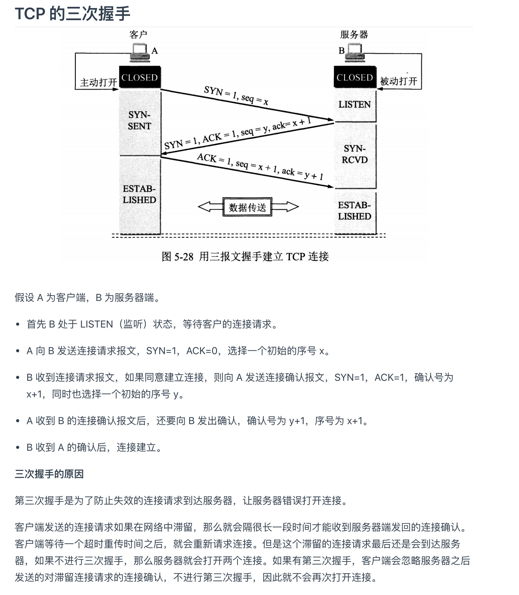
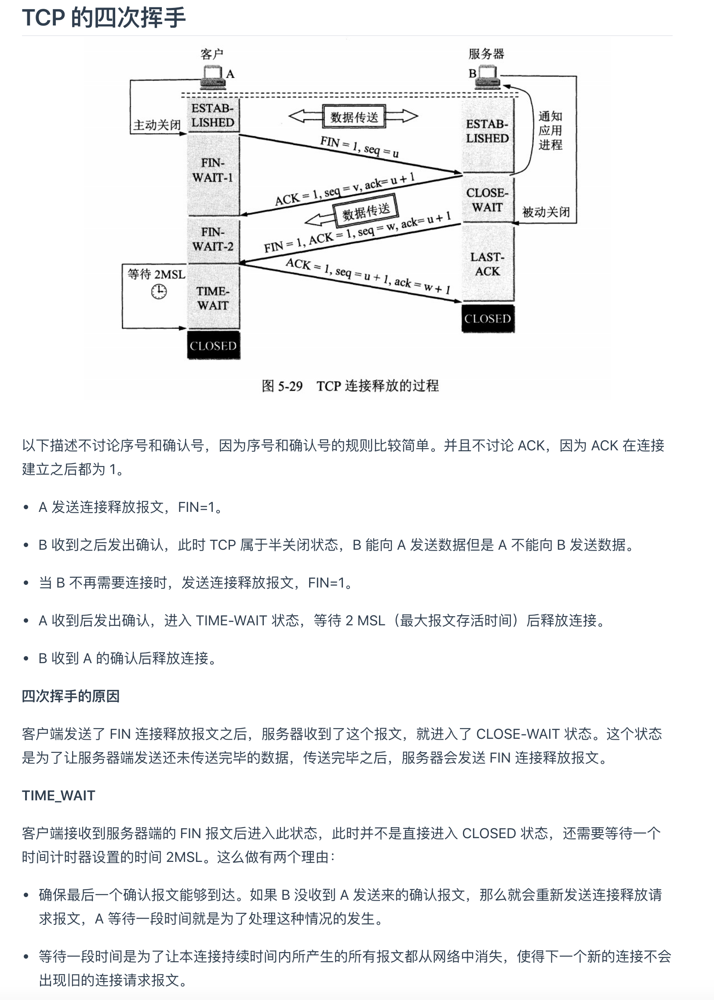

### 复习 01
***

>TCP相关基础知识

##### 1.请详细描述三次握手和四次挥手的过程 (要求画出状态图)
- [参考](http://www.cyc2018.xyz/%E8%AE%A1%E7%AE%97%E6%9C%BA%E5%9F%BA%E7%A1%80/%E7%BD%91%E7%BB%9C%E5%9F%BA%E7%A1%80/%E8%AE%A1%E7%AE%97%E6%9C%BA%E7%BD%91%E7%BB%9C%20-%20%E4%BC%A0%E8%BE%93%E5%B1%82.html#tcp-%E7%9A%84%E4%B8%89%E6%AC%A1%E6%8F%A1%E6%89%8B)
- [图示](https://app.diagrams.net/#G1HjbGX1G1zT_fIA3kyNe8XcCMR068_fUX)
 
 
 
##### 2.四次挥手中TIME_WAIT状态存在的目的是什么?
```text
TIME_WAIT
客户端接收服务端的FIN报文后进入此状态，此时并不是直接接入CLOSE状态，
还需要等待一个时间计数器设置的时间2MSL，这么做有两个理由
1.确保最后一个确让报文能够到达，如果 B 没收到 A 发送来的确认报文，那么就会重新发送连接释放请求报文，A 等待一段时间就是为了处理这种情况的发生。
2.等待一段时间是为了让本连接持续时间内所产生的所有报文都从网络中消失，使得下一个新的连接不会出现旧的连接请求报文。
```

##### 3.TCP是通过什么机制保障可靠性的?
- [参考](http://www.cyc2018.xyz/%E8%AE%A1%E7%AE%97%E6%9C%BA%E5%9F%BA%E7%A1%80/%E7%BD%91%E7%BB%9C%E5%9F%BA%E7%A1%80/%E8%AE%A1%E7%AE%97%E6%9C%BA%E7%BD%91%E7%BB%9C%20-%20%E4%BC%A0%E8%BE%93%E5%B1%82.html#tcp-%E5%8F%AF%E9%9D%A0%E4%BC%A0%E8%BE%93)
- *ACK确让机制/超时重传/滑动窗口/流量控制*
```text
流量控制是为了控制发送方发送速率，保证接收方来得及接收。
接收方发送的确认报文中的窗口字段可以用来控制发送方窗口大小，从而影响发送方的发送速率。
将窗口字段设置为 0，则发送方不能发送数据。
#
```