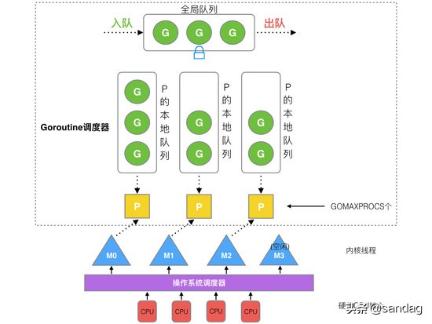

### 复习 01
***

>TCP相关基础知识

##### 1.请详细描述三次握手和四次挥手的过程 (要求画出状态图)
- [参考1](http://www.cyc2018.xyz/%E8%AE%A1%E7%AE%97%E6%9C%BA%E5%9F%BA%E7%A1%80/%E7%BD%91%E7%BB%9C%E5%9F%BA%E7%A1%80/%E8%AE%A1%E7%AE%97%E6%9C%BA%E7%BD%91%E7%BB%9C%20-%20%E4%BC%A0%E8%BE%93%E5%B1%82.html#tcp-%E7%9A%84%E4%B8%89%E6%AC%A1%E6%8F%A1%E6%89%8B)
- [参考2](https://segmentfault.com/a/1190000023565467)
- [图示](https://app.diagrams.net/#G1HjbGX1G1zT_fIA3kyNe8XcCMR068_fUX)
 
 
 
##### 2.四次挥手中TIME_WAIT状态存在的目的是什么?
```text
TIME_WAIT
客户端接收服务端的FIN报文后进入此状态，此时并不是直接接入CLOSE状态，
还需要等待一个时间计数器设置的时间2MSL，这么做有两个理由
1.确保最后一个确让报文能够到达，如果 B 没收到 A 发送来的确认报文，那么就会重新发送连接释放请求报文，A 等待一段时间就是为了处理这种情况的发生。
2.等待一段时间是为了让本连接持续时间内所产生的所有报文都从网络中消失，使得下一个新的连接不会出现旧的连接请求报文。
```

##### 3.TCP是通过什么机制保障可靠性的?
- [参考](http://www.cyc2018.xyz/%E8%AE%A1%E7%AE%97%E6%9C%BA%E5%9F%BA%E7%A1%80/%E7%BD%91%E7%BB%9C%E5%9F%BA%E7%A1%80/%E8%AE%A1%E7%AE%97%E6%9C%BA%E7%BD%91%E7%BB%9C%20-%20%E4%BC%A0%E8%BE%93%E5%B1%82.html#tcp-%E5%8F%AF%E9%9D%A0%E4%BC%A0%E8%BE%93)
- *ACK确让机制/超时重传/滑动窗口/流量控制*
```text
流量控制是为了控制发送方发送速率，保证接收方来得及接收。
接收方发送的确认报文中的窗口字段可以用来控制发送方窗口大小，从而影响发送方的发送速率。
将窗口字段设置为 0，则发送方不能发送数据。
```

##### 4.TCP为什么是四次挥手而不是三次？
```text
因为服务端在接收到FIN, 往往不会立即返回FIN, 必须等到服务端所有的报文都发送完毕了，才能发FIN。
因此先发一个ACK表示已经收到客户端的FIN，延迟一段时间才发FIN。这就造成了四次挥手。
如果是三次挥手会有什么问题？
等于说服务端将ACK和FIN的发送合并为一次挥手，这个时候长时间的延迟可能会导致客户端误以为FIN没有到达客户端，从而让客户端不断的重发FIN。
```

> 基础
##### 1.描述线程、进程以及协程的区别? 描述线程、进程以及协程的定义和区别。
[参考](https://www.cnblogs.com/lxmhhy/p/6041001.html)
```text
1、进程
进程是具有一定独立功能的程序关于某个数据集合上的一次运行活动,进程是系统进行资源分配和调度的一个独立单位。
每个进程都有自己的独立内存空间，不同进程通过进程间通信来通信。由于进程比较重量，占据独立的内存，
所以上下文进程间的切换开销（栈、寄存器、虚拟内存、文件句柄等）比较大，但相对比较稳定安全。

2、线程
线程是进程的一个实体,是CPU调度和分派的基本单位,它是比进程更小的能独立运行的基本单位.
线程自己基本上不拥有系统资源,只拥有一点在运行中必不可少的资源(如程序计数器,一组寄存器和栈),
但是它可与同属一个进程的其他的线程共享进程所拥有的全部资源。
线程间通信主要通过共享内存，上下文切换很快，资源开销较少，但相比进程不够稳定容易丢失数据。

3、协程
协程是一种用户态的轻量级线程，协程的调度完全由用户控制。协程拥有自己的寄存器上下文和栈。协程调度切换时，
将寄存器上下文和栈保存到其他地方，在切回来的时候，恢复先前保存的寄存器上下文和栈，直接操作栈则基本没有内核切换的开销，
可以不加锁的访问全局变量，所以上下文的切换非常快。

二、区别：
1、进程多与线程比较
线程是指进程内的一个执行单元,也是进程内的可调度实体。线程与进程的区别:
1) 地址空间:线程是进程内的一个执行单元，进程内至少有一个线程，它们共享进程的地址空间，而进程有自己独立的地址空间
2) 资源拥有:进程是资源分配和拥有的单位,同一个进程内的线程共享进程的资源
3) 线程是处理器调度的基本单位,但进程不是
4) 二者均可并发执行
5) 每个独立的进程有一个程序运行的入口、顺序执行序列和程序的出口，但是线程不能够独立执行，必须依存在应用程序中，由应用程序提供多个线程执行控制

2、协程多与线程进行比较
1) 一个线程可以多个协程，一个进程也可以单独拥有多个协程，这样python中则能使用多核CPU。
2) 线程进程都是同步机制，而协程则是异步
3) 协程能保留上一次调用时的状态，每次过程重入时，就相当于进入上一次调用的状态
```

##### 2.Go中GMP机制
- [参考1](https://www.liwenzhou.com/posts/Go/14_concurrence/)
- [参考2](https://www.cnblogs.com/sunsky303/p/9705727.html)
- [参考3](https://www.toutiao.com/i6797580089891488259/?tt_from=weixin&utm_campaign=client_share&wxshare_count=1&timestamp=1614737302&app=news_article&utm_source=weixin&utm_medium=toutiao_android&use_new_style=1&req_id=202103031008210101511921373520168F&group_id=6797580089891488259)
```text
goroutine调度
GPM是Go语言运行时（runtime）层面的实现，是go语言自己实现的一套调度系统。区别于操作系统调度OS线程。

G很好理解，就是个goroutine的，里面除了存放本goroutine信息外 还有与所在P的绑定等信息。

P管理着一组goroutine队列，P里面会存储当前goroutine运行的上下文环境（函数指针，堆栈地址及地址边界），P会对自己管理的goroutine队列做一些调度（比如把占用CPU时间较长的goroutine暂停、运行后续的goroutine等等）
当自己的队列消费完了就去全局队列里取，如果全局队列里也消费完了会去其他P的队列里抢任务。

M（machine）是Go运行时（runtime）对操作系统内核线程的虚拟， M与内核线程一般是一一映射的关系， 一个groutine最终是要放到M上执行的；

P与M一般也是一一对应的。他们关系是： P管理着一组G挂载在M上运行。当一个G长久阻塞在一个M上时，runtime会新建一个M，阻塞G所在的P会把其他的G 挂载在新建的M上。当旧的G阻塞完成或者认为其已经死掉时 回收旧的M。
P的个数是通过runtime.GOMAXPROCS设定（最大256），Go1.5版本之后默认为物理线程数。 在并发量大的时候会增加一些P和M，但不会太多，切换太频繁的话得不偿失。

单从线程调度讲，Go语言相比起其他语言的优势在于OS线程是由OS内核来调度的，goroutine则是由Go运行时（runtime）自己的调度器调度的，这个调度器使用一个称为m:n调度的技术（复用/调度m个goroutine到n个OS线程）。 
其一大特点是goroutine的调度是在用户态下完成的， 不涉及内核态与用户态之间的频繁切换，包括内存的分配与释放，都是在用户态维护着一块大的内存池， 不直接调用系统的malloc函数（除非内存池需要改变），成本比调度OS线程低很多。
另一方面充分利用了多核的硬件资源，近似的把若干goroutine均分在物理线程上， 再加上本身goroutine的超轻量，以上种种保证了go调度方面的性能。
```
- GMP 模型
 - 
- go func() 调度流程
 - 