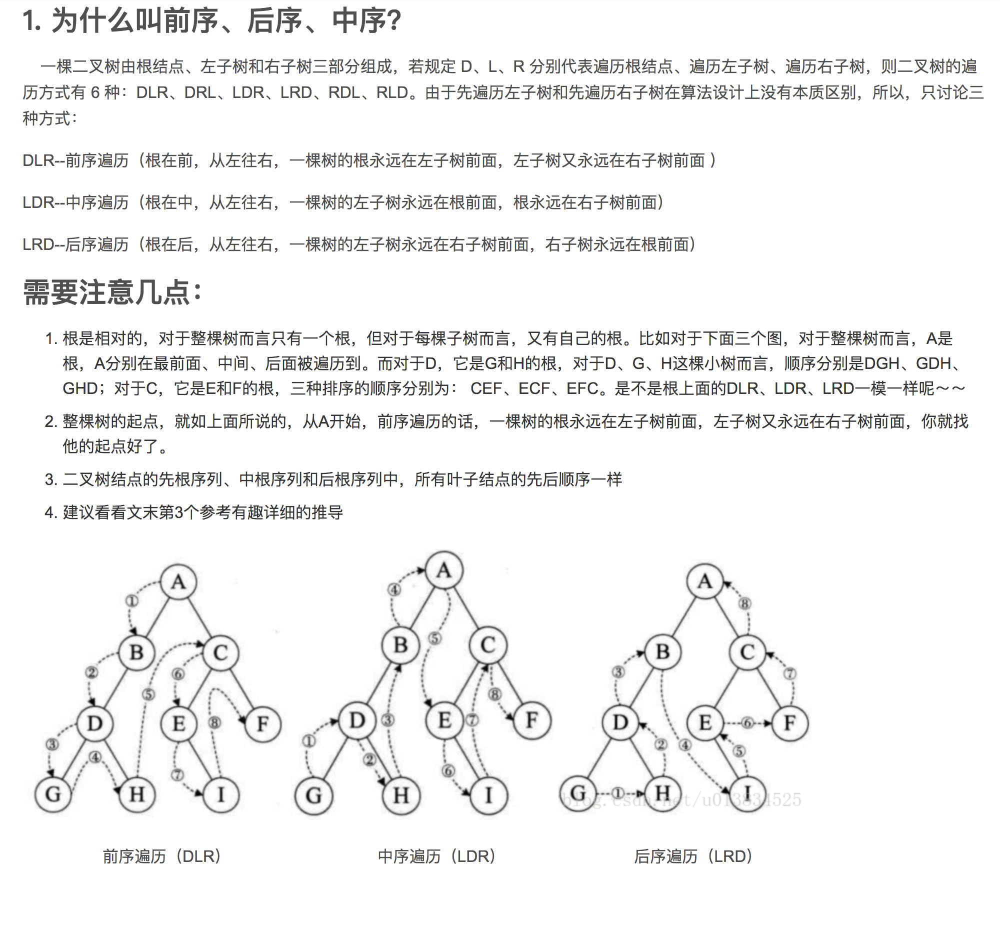
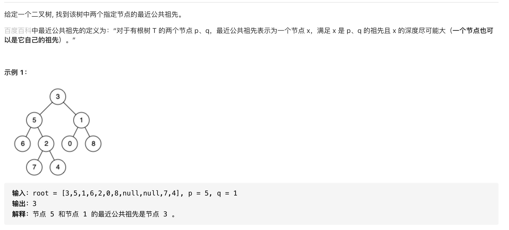

### 复习 02
***

>缓存和数据库的基础知识

##### 1.描述一下redis有哪些数据结构。
- [redis知识点](http://www.cyc2018.xyz/%E6%95%B0%E6%8D%AE%E5%BA%93/Redis.html)
- 基础的数据结构有5种，String/List/Hash/Set/Zset，还答了高级数据结构HyperLogLog/BitMap/BloomFilter/GeoHash。
BloomFilter的原理以及Zset的实现原理，主要讲解跳跃表。
- [BloomFilter原理](http://oserror.com/backend/bloomfilter/) 表示不懂
- [skipList跳跃表](https://segmentfault.com/a/1190000022320734)
- [AOF重写机制](https://blog.csdn.net/sand_clock/article/details/88624424)

##### 2.MySQL场景题目
- 面试官提供场景，要求写出查询SQL，考察联合语句，如何分页以及复杂语句的优化。

##### 3.树的非递归先序遍历
- [源代码](../algorithm/binary.go)
- 
```go
// 先序遍历-非递归
func (bt *BinaryTree) PreOrderNoRecursion() []interface{} {
	t := bt
	stack := list.New()
	res := make([]interface{}, 0)
	for t != nil || stack.Len() != 0 {
		for t != nil {
			res = append(res, t.Data) //visit
			stack.PushBack(t)
			t = t.Left
		}
		if stack.Len() != 0 {
			v := stack.Back()
			t = v.Value.(*BinaryTree)
			t = t.Right
			stack.Remove(v)
		}
	}
	return res
}
```
##### 4.分布式事务以及分布式一致性等问题
- [分布式ID生成方案](https://tech.meituan.com/2017/04/21/mt-leaf.html)

##### 5.API业务的架构问题，负载均衡、CDN、DNS等问题

##### 6.HTTP的版本之间的区别，主要是1.0/1.1/2.0三个版本的区别。详细说了1.0与1.1之间是连接模型的区别(短连接、长连接、管线化)，1.1与2.0之间的区别是I/O多路复用的单一长连接、服务器推送、二进制分桢、首部压缩等。
- [参考](https://juejin.cn/post/6844903923136856078)
```text
HTTP1.0
特性
无状态：服务器不跟踪不记录请求过的状态
无连接：浏览器每次请求都需要建立tcp连接

无状态
对于无状态的特性可以借助cookie/session机制来做身份认证和状态记录
无连接
无连接导致的性能缺陷有两种：

无法复用连接
每次发送请求，都需要进行一次tcp连接（即3次握手4次挥手），使得网络的利用率非常低
队头阻塞
HTTP 1.0 规定在前一个请求响应到达之后下一个请求才能发送，如果前一个阻塞，后面的请求也给阻塞的

HTTP1.1
特性
长连接：新增Connection字段，可以设置keep-alive值保持连接不断开
管道化：基于上面长连接的基础，管道化可以不等第一个请求响应继续发送后面的请求，但响应的顺序还是按照请求的顺序返回
缓存处理：新增字段cache-control
断点传输

长连接
HTTP 1.1默认保持长连接，数据传输完成保持tcp连接不断开,继续用这个通道传输数据
管道化
基于长连接的基础，我们先看没有管道化请求响应：
tcp没有断开，用的同一个通道
缓存处理
当浏览器请求资源时，先看是否有缓存的资源，如果有缓存，直接取，不会再发请求，如果没有缓存，则发送请求。
通过设置字段cache-control来控制缓存。
断点传输
在上传/下载资源时，如果资源过大，将其分割为多个部分，分别上传/下载，如果遇到网络故障，可以从已经上传/下载好的地方继续请求，不用从头开始，提高效率

HTTP2.0
特性:
二进制分帧
多路复用： 在共享TCP链接的基础上同时发送请求和响应
头部压缩
服务器推送：服务器可以额外的向客户端推送资源，而无需客户端明确的请求

二进制分帧
HTTP 1.x 的解析是基于文本，HTTP 2之后将所有传输的信息分割为更小的消息和帧，并对它们采用二进制格式的编码，提高传输效率
多路复用
在共享TCP链接的基础上同时发送请求和响应，基于二进制分帧，在同一域名下所有访问都是从同一个tcp连接中走，http消息被分解为独立的帧，乱序发送，服务端根据标识符和首部将消息重新组装起来。
头部压缩
由于 HTTP 是无状态的，每一个请求都需要头部信息标识这次请求相关信息，所以会造成传输很多重复的信息，当请求数量增大的时候，消耗的资源就会慢慢积累上去。所以 HTTP 2 可以维护一个头部信息字典，差量进行更新头信息，减少头部信息传输占用的资源，详见 HTTP/2 头部压缩技术介绍。


```

##### 7.螺旋矩阵
- [力扣](https://leetcode-cn.com/problems/spiral-matrix/)
- [参考](https://github.com/olzhy/leetcode/blob/master/54_Spiral_Matrix/test.go)


#### 8.二叉树的最近公共祖先
- [参考](https://leetcode-cn.com/problems/lowest-common-ancestor-of-a-binary-tree/solution/golanger-cha-shu-de-gong-gong-zu-xian-by-wzycc/)
- [Demo](../algorithm/lowestcommancestor.go)
- 
```go
type TreeNode struct {
  Val int
  Left *ListNode
  Right *ListNode
}

func lowestCommonAncestor(root, p, q *TreeNode) *TreeNode { // 236. 二叉树的最近公共祖先
	if root == nil { // 此时不可能查询到结果
		return nil
	}
	if root.Val == p.Val || root.Val == q.Val { // 子树中寻找到结果节点，返回root
		return root
	}

	left := lowestCommonAncestor(root.Left, p, q)   // 寻找左子树
	right := lowestCommonAncestor(root.Right, p, q) // 寻找右子树

	if left == nil { // 从下一层返回来的查询结果为nil 没有找到
		return right
	} else if right == nil { // 从下一层返回来的查询结果为nil 没有找到
		return left
	} else { // 当左右子树都找到时返回root
		return root
	}

	return nil // 当在此棵子树上进行查找无pq时，返回nil
}

```


##### 9.大库DDL
- [参考](https://blog.csdn.net/frog4/article/details/82702745)
```text
mysql5.6 以后 online ddl
```

##### 10.一些算法(golang)
- [参考](https://www.liwenzhou.com/posts/Go/LeetCode/)

##### 11.GO垃圾回收
- [参考](https://juejin.cn/post/6844903917650722829)

#### 12.MySQL 到底是怎么解决幻读的？
- [参考](https://www.cnblogs.com/wudanyang/p/10655180.html)
- [参考](https://www.toutiao.com/i6930164998287589896/)
```text
一、什么是幻读
在一次事务里面，多次查询之后，结果集的个数不一致的情况叫做幻读。而多或者少的那一行被叫做 幻行

二、为什么要解决幻读
在高并发数据库系统中，需要保证事务与事务之间的隔离性，还有事务本身的一致性。

三、MySQL 是如何解决幻读的
如果你看到了这篇文章，那么我会默认你了解了 脏读 、不可重复读与可重复读。

1. 多版本并发控制（MVCC）（快照读/一致性读）
多数数据库都实现了多版本并发控制，并且都是靠保存数据快照来实现的。

以 InnoDB 为例。可以理解为每一行中都冗余了两个字段，一个是行的创建版本，一个是行的删除（过期）版本。
具体的版本号（trx_id）存在 information_schema.INNODB_TRX 表中。

版本号（trx_id）随着每次事务的开启自增。
事务每次取数据的时候都会取创建版本小于当前事务版本的数据，以及过期版本大于当前版本的数据。
普通的 select 就是快照读。
```

##### 13.mongoDb为什么使用B数
- [参考](https://www.jianshu.com/p/c068bd1fdaf7)
```text
MongoDB 认为查询单个数据记录远比遍历数据更加常见，由于 B 树的非叶结点也可以存储数据，所以查询一条数据所需要的平均随机 IO 次数会比 B+ 树少，
使用 B 树的 MongoDB 在类似场景中的查询速度就会比 MySQL 快.

```

##### 14.乐观锁，悲观锁
- [参考](https://www.jianshu.com/p/d2ac26ca6525)
```text
乐观锁比较适用于读多写少的情况(多读场景)，悲观锁比较适用于写多读少的情况(多写场景)。

悲观锁主要分为共享锁和排他锁：悲观锁：
共享锁【shared locks】又称为读锁，简称S锁。顾名思义，共享锁就是多个事务对于同一数据可以共享一把锁，都能访问到数据，但是只能读不能修改。
排他锁【exclusive locks】又称为写锁，简称X锁。顾名思义，排他锁就是不能与其他锁并存，如果一个事务获取了一个数据行的排他锁，其他事务就不能再获取该行的其他锁，包括共享锁和排他锁，但是获取排他锁的事务是可以对数据行读取和修改。

```
