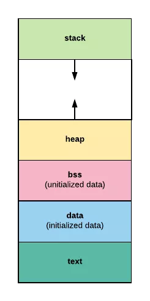

##### 1.利用redis完成分布式锁、延迟队列、位图、布隆过滤器、限流等应用说明 -- Redis应用篇
- [参考](https://blog.csdn.net/IT_faquir/article/details/109225618)
```text
延迟队列： brpop/lrpop
```

##### 2.nginx 限流方案
- [参考](https://juejin.cn/post/6844903950815068174)
```text
Nginx限流主要分为两种方式：
限制访问频率
限制并发连接数
```

##### 3.四层负载均衡和七层负载均衡的区别在哪里
- [参考](https://zhuanlan.zhihu.com/p/34904010)

#### 4.go context 
- [参考](https://www.liwenzhou.com/posts/Go/go_context/)


##### 5. 布隆过滤器原来已经应用场景
- [参考](https://www.zhihu.com/question/389604738)
```text

```

##### 6. 程序的内存布局

```text
最后看一下程序的内存布局。现在我们知道了每个程序都有自己一套独立的地址空间可以使用，
比如 0x0000 ~ 0xffff，但我们在用高级语言，无论是 C 还是 Go 写程序的时候，很少直接使用这些地址。我们都是通过变量名来访问数据的，编译器会自动将我们的变量名转换成真正的虚拟地址。
         
 那最终编译出来的二进制文件，是如何被操作系统加载到内存中并执行的呢？
 
 其实，操作系统已经将一整块内存划分好了区域，每个区域用来做不同的事情。如图：
 
 内存布局
 text 段：存储程序的二进制指令，及其他的一些静态内容
 data 段：用来存储已被初始化的全局变量。比如常量（const）。
 bss 段：用来存放未被初始化的全局变量。和 .data 段一样都属于静态分配，在这里面的变量数据在编译就确定了大小，不释放。
 stack 段：栈空间，主要用于函数调用时存储临时变量的。这部分的内存是自动分配自动释放的。
 heap 段：堆空间，用于动态分配，C 语言中 malloc 和 free 操作的内存就在这里；Go 语言主要靠 GC 自动管理这部分。
 其实现在的操作系统，进程内部的内存区域没这么简单，要比这复杂多了，比如内核区域，共享库区域。因为我们不是要真的开发一套操作系统，细节可以忽略。这里只需要记住堆空间和栈空间即可。
 
 栈空间是通过压栈出栈方式自动分配释放的，由系统管理，使用起来高效无感知。
 堆空间是用以动态分配的，由程序自己管理分配和释放。Go 语言虽然可以帮我们自动管理分配和释放，但是代价也是很高的。
 
 
```

##### CAP
- [参考](http://www.cyc2018.xyz/%E5%85%B6%E5%AE%83/%E7%B3%BB%E7%BB%9F%E8%AE%BE%E8%AE%A1/%E5%88%86%E5%B8%83%E5%BC%8F.html#%E4%B8%89%E3%80%81cap) 
- [参考](https://blog.csdn.net/yeyazhishang/article/details/80758354) 
```text
分布式系统不可能同时满足一致性（C：Consistency）、可用性（A：Availability）和分区容忍性（P：Partition Tolerance），最多只能同时满足其中两项

#一致性
一致性指的是多个数据副本是否能保持一致的特性，在一致性的条件下，系统在执行数据更新操作之后能够从一致性状态转移到另一个一致性状态。
对系统的一个数据更新成功之后，如果所有用户都能够读取到最新的值，该系统就被认为具有强一致性。

#可用性
可用性指分布式系统在面对各种异常时可以提供正常服务的能力，可以用系统可用时间占总时间的比值来衡量，4 个 9 的可用性表示系统 99.99% 的时间是可用的。
在可用性条件下，要求系统提供的服务一直处于可用的状态，对于用户的每一个操作请求总是能够在有限的时间内返回结果。

#分区容忍性
网络分区指分布式系统中的节点被划分为多个区域，每个区域内部可以通信，但是区域之间无法通信。
在分区容忍性条件下，分布式系统在遇到任何网络分区故障的时候，仍然需要能对外提供一致性和可用性的服务，除非是整个网络环境都发生了故障。

#权衡
在分布式系统中，分区容忍性必不可少，因为需要总是假设网络是不可靠的。因此，CAP 理论实际上是要在可用性和一致性之间做权衡。
可用性和一致性往往是冲突的，很难使它们同时满足。在多个节点之间进行数据同步时，

为了保证一致性（CP），不能访问未同步完成的节点，也就失去了部分可用性；
为了保证可用性（AP），允许读取所有节点的数据，但是数据可能不一致。
#

```