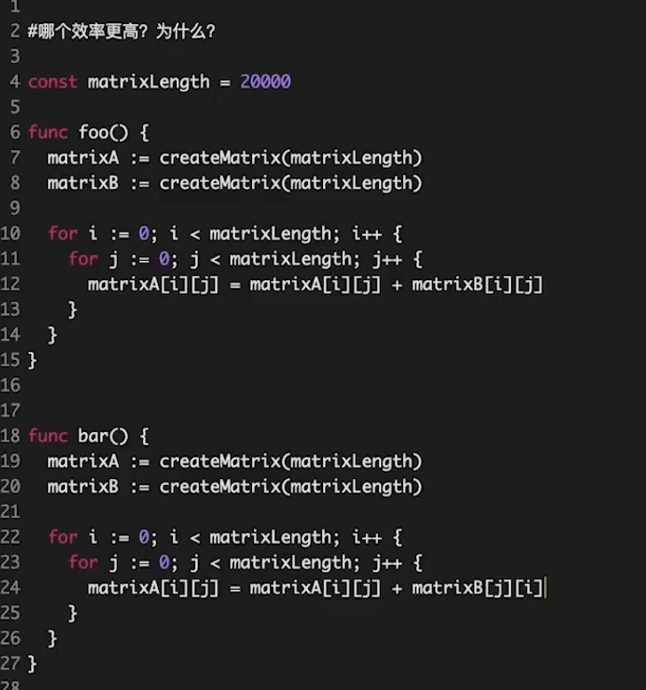

> go 中高级
- [视频](https://www.bilibili.com/video/BV12p4y1W7Dz)

##### 2. 代码效率分析，考察局部性原理
- 
- 哪个效率更高？为什么？
```text
第一个
差别： matrix[i][j] ,  matrix[j][i] ,
第一个在内存中是连续的地址， 利用cache加速 

局部性原理：一个良好的计算机程序 常常具有良好的局部性，也就是说，它们倾向于引用邻近于其他最近引用过的数据项的数据项，或者最近引用过的数据项本身。

局部性的两种不同的形式：时间局部性和空间局部性
时间局部性
时间局部性是指如果程序中的某条指令一旦执行，则不久之后该指令可能再次被执行；如果某数据被访问，则不久之后该数据可能再次被访问。强调数据的重复访问。
利用时间局部性，缓存在现代程序系统中扮演着重要角色，数据缓存，磁盘缓存，文件缓存等，极大提高数据的重复访问性能。

空间局部性
空间局部性是指一旦程序访问了某个存储单元，则不久之后。其附近的存储单元也将被访问。强调连续空间数据的访问，
一般顺序访问每个元素（步长为1）时具有最好的空间局部性，步长越大，空间局部性越差。


```
##### 3. 多核CPU场景下，cache如何保持一致、不冲突？
```text
MESI多核CPU 保证cache不冲突 ： 
- https://blog.csdn.net/reliveIT/article/details/50450136
```
##### 4. uint类型溢出
```text
func main() {
    var a uint = 1
    var b uint = 2
    fmt.Println(a-b)
}

当前位数的最大值32位的话就是 2^32 ， 64位的系统就是 2^64， -1的补码都只为1
```
##### 5. 介绍rune类型
- [参考](https://juejin.cn/post/6844903636313571341)
```text
rune 是 int32 类型
用来做字符长度计算
rune类型，代表一个 UTF-8字符。
rune类型用来表示utf8字符，一个rune字符由一个或多个byte组成
golang中string底层是通过byte数组实现的。中文字符在unicode下占2个字节，
在utf-8编码下占3个字节，而golang默认编码正好是utf-8。
byte 等同于int8，常用来处理ascii字符
rune 等同于int32,常用来处理unicode或utf-8字符
```

##### 6. 编程题：3个函数分别打印cat、dog、fish，要求每个函数都要起一个goroutine，按照cat、dog、fish顺序打印在屏幕上100次。
```go
package main

import "fmt"

func Cat(ch chan int) {
	fmt.Println("cat")
	ch <- 0
}
func Dog(ch chan int) {
	fmt.Println("dog")
	ch <- 0
}
func Fish(ch chan int) {
	fmt.Println("fish")
	ch <- 0
}

func main() {
	ch := make(chan int, 1)

	for i := 0; i < 100; i++ {
		go Cat(ch)
		<-ch
		go Dog(ch)
		<-ch
		go Fish(ch)
		<-ch
	}
}

```

##### 7. 介绍一下channel，无缓冲和有缓冲区别
```text
channnel 有缓存，无缓存


```
##### 8. 是否了解channel底层实现，比如实现channel的数据结构是什么？
```text
环形数字， 
长度
双指针
```
##### 9. channel是否线程安全？
```text
是线程安全
用到锁机制 mutex , 互斥锁
```
##### 10. Mutex是悲观锁还是乐观锁？悲观锁、乐观锁是什么？
```text
悲观锁：
读写互斥
乐观锁？

 
```

##### 11. Mutex几种模式？
```text
互斥模式
饥饿模式
```
##### 12. Mutex可以做自旋锁吗？
```text
什么是自旋锁
可以
互斥模式，可以的
```
##### 13. 介绍一下RWMutex
```text
读多写少

```
##### 14. 项目中用过的锁？

```text
读写锁

```

##### 15. 介绍一下线程安全的共享内存方式
```text
channel 做数据交换
```

##### 16. 介绍一下goroutine
```text
GMP模式


```
##### 17. goroutine自旋占用cpu如何解决（go调用、gmp）
```text
GO 自旋， 抢占， 信号的通信
```
##### 18. 介绍linux系统信号
```text
SINGEL ， USER2 
```

##### 19. goroutine抢占时机（gc 栈扫描）
```text
stop the world
```
##### 20. Gc触发时机
```text

```
##### 21. 是否了解其他gc机制
```text
手动
使用量达到数量级， 触发垃圾回收
三色标记法
```
##### 22. Go内存管理方式
- [参考](https://www.jianshu.com/p/7405b4e11ee2)
```text

```
##### 23. Channel分配在栈上还是堆上？哪些对象分配在堆上，哪些对象分配在栈上？
- [内存逃逸](https://mp.weixin.qq.com/s/4YYR1eYFIFsNOaTxL4Q-eQ)
- [内存逃逸](https://www.jianshu.com/p/518466b4ee96)
```text
heap 堆上

```

##### 24. 介绍一下大对象小对象，为什么小对象多了会造成gc压力？
```text
大对象
如上面所述，最大的 sizeclass 最大只能存放 32K 的对象。如果一次性申请超过 32K 的内存，系统会直接绕过 mcache 和 mcentral，直接从 mheap 上获取，mheap 中有一个 freelarge 字段管理着超大 span。

通常小对象过多会导致GC三色法消耗过多的GPU。
优化思路是，减少对象分配.
```

##### 25. 项目中遇到的oom情况？
```text

```
##### 26. 项目中使用go遇到的坑？
```text

```
##### 27. 工作遇到的难题、有挑战的事情，如何解决？
```text

```
##### 28. 如何指定指令执行顺序？
```text

```
##### 29.  纪要
```text

1.uint不能直接相减，结果是负数会变成一个很大的uint，这点对动态语言出身的会可能坑。channel一定记得close。goroutine记得return或者中断，不然容易造成goroutine占用大量CPU。从slice创建slice的时候，注意原slice的操作可能导致底层数组变化。如果你要创建一个很长的slice，尽量创建成一个slice里存引用，这样可以分批释放，避免gc在低配机器上stop the world面试的时候尽量了解协程，线程，进程的区别。明白channel是通过注册相关goroutine id实现消息通知的。slice底层是数组，保存了len，capacity和对数组的引用。如果了解协程的模型，就知道所谓抢占式goroutine调用是什么意思。尽量了解互斥锁，读写锁，死锁等一些数据竞争的概念，debug的时候可能会有用。尽量了解golang的内存模型，知道多小才是小对象，为什么小对象多了会造成gc压力。
2.channel一定记得close
3.goroutine记得return或者中断，不然容易造成goroutine占用大量CPU。
4.从slice创建slice的时候，注意原slice的操作可能导致底层数组变化。
5.如果你要创建一个很长的slice，尽量创建成一个slice里存引用，这样可以分批释放，避免gc在低配机器上stop the world
6.明白channel是通过注册相关goroutine id实现消息通知的。
7.slice底层是数组，保存了len，capacity和对数组的引用。
8.如果了解协程的模型，就知道所谓抢占式goroutine调用是什么意思。
9.尽量了解互斥锁，读写锁，死锁等一些数据竞争的概念，debug的时候可能会有用。
10.尽量了解golang的内存模型，知道多小才是小对象，为什么小对象多了会造成gc压力。

```
