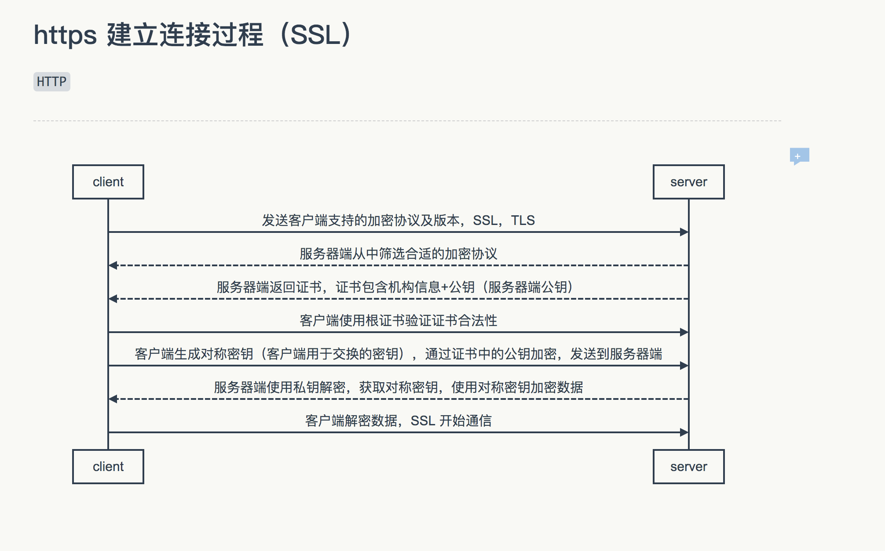

#### 字节后台二面
- https://www.nowcoder.com/discuss/615929?type=2&channel=-1&source_id=discuss_terminal_discuss_hot_nctrack


##### 说一下项目中用到的redis分布式锁
- [参考](https://segmentfault.com/a/1190000037798450)
- [参考](https://www.infoq.cn/article/dvaaj71f4fbqsxmgvdce)
```text
三种实现方式
常见分布式锁一般有三种实现方式：1. 数据库锁；2. 基于ZooKeeper的分布式锁；3. 基于Redis的分布式锁。

数据库锁：这种方式很容易被想到，把竞争的资源放到数据库中，利用数据库锁来实现资源竞争，可以参考之前的文章《数据库事务和锁》。例如：（1）悲观锁实现：查询库存商品的sql可以加上 "FOR UPDATE" 以实现排他锁，并且将“查询库存”和“减库存”打包成一个事务 COMMIT，在A用户查询和购买完成之前，B用户的请求都会被阻塞住。（2）乐观锁实现：在库存表中加上版本号字段来控制。或者更简单的实现是，当每次购买完成后发现库存小于零了，回滚事务即可。
zookeeper的分布式锁：实现分布式锁，ZooKeeper是专业的。它类似于一个文件系统，通过多系统竞争文件系统上的文件资源，起到分布式锁的作用。具体的实现方式，请参考之前的文章《zookeeper的开发应用》。
redis的分布式锁：之前的文章讲过redis的开发应用和事务，一直没有讲过redis的分布式锁，这也是本文的核心内容。简单来说是通过setnx竞争键的值。

“数据库锁”是竞争表级资源或行级资源，“zookeeper锁”是竞争文件资源，“redis锁”是为了竞争键值资源。它们都是通过竞争程序外的共享资源，来实现分布式锁。

1，lua + setnx + expire 加锁， 但是两个不是原子操作 ： 这样实现的分布式锁仍然存在一个严重的问题，由于 SETNX 和 EXPIRE 这两个操作是非原子性的， 如果进程在执行 SETNX 和 EXPIRE 之间发生异常，SETNX 执行成功，但 EXPIRE 没有执行，导致这把锁变得“长生不老”
2，使用 SET 扩展指令 ， set key value NX EX 10 : 仍然不能彻底解决分布式锁超时问题：锁被提前释放/锁被误删
3, Redisson 的分布式锁
单实例原子性非常重要

4，Redis 多机实现的分布式锁 Redlock
```

##### 4. redis集群模式下的RedLock分布式锁算法
- [参考](https://zhuanlan.zhihu.com/p/40915772)
- [参考](https://www.cnblogs.com/rgcLOVEyaya/p/RGC_LOVE_YAYA_1003days.html)
- [参考](https://zhuanlan.zhihu.com/p/44073906)
```text
算法很易懂，起 5 个 master 节点，分布在不同的机房尽量保证可用性。为了获得锁，client 会进行如下操作：

1，得到当前的时间，微妙单位
2，尝试顺序地在 5 个实例上申请锁，当然需要使用相同的 key 和 random value，这里一个 client 需要合理设置与 master 节点沟通的 timeout 大小，避免长时间和一个 fail 了的节点浪费时间
3，当 client 在大于等于 3 个 master 上成功申请到锁的时候，且它会计算申请锁消耗了多少时间，这部分消耗的时间采用获得锁的当下时间减去第一步获得的时间戳得到，如果锁的持续时长（lock validity time）比流逝的时间多的话，那么锁就真正获取到了。
4，如果锁申请到了，那么锁真正的 lock validity time 应该是 origin（lock validity time） - 申请锁期间流逝的时间
5，如果 client 申请锁失败了，那么它就会在少部分申请成功锁的 master 节点上执行释放锁的操作，重置状态

```

##### 5. 项目中设置的分布式锁超时时间是多少
```text

500ms拿不到锁, 就认为获取锁失败。10000ms即10s是锁失效时间。
```

##### 客户端拿到分布式锁后锁超时被redis过期了，客户端释放锁时怎么处理（比较锁的value是否和当初自己设置的value相等）

##### 客户端释放分布式锁失败后，需要进行什么处理

##### 怎么实现redis分布式锁的重入（回答了在设置value的时候，设置value为当前机器id+线程id+重入次数）

##### RedLock算法下，如果各有一半的锁分别被两个客户端获取了，怎么处理
```text
https://blog.csdn.net/pysense/article/details/101176308
```

##### 说一下项目中怎么用到消息队列

##### 使用RabbitMQ会遇到什么问题吗
```text
我说有可能会遇到消息丢失的情况
```

##### 怎么解决RabbitMQ消息丢失
- [参考](https://blog.csdn.net/wangxiang1292/article/details/102148362)
```text
所以有三个地方都会丢失数据：
生产者发送给MQ的途中出现网络问题
MQ自己没保管好弄丢了
消费者拿到数据后出错了没有最终完成任务

```

##### RabbitMQ在生产者确认消息到达后，如果还没把消息写入磁盘就挂了，怎么解决这种情况的消息丢失？
```text
RabbitMQ弄丢了数据-开启RabbitMQ的数据持久化

为了防止rabbitmq自己弄丢了数据，这个你必须开启rabbitmq的持久化，就是消息写入之后会持久化到磁盘，哪怕是rabbitmq自己挂了，恢复之后会自动读取之前存储的数据，一般数据不会丢。除非极其罕见的是，rabbitmq还没持久化，自己就挂了，可能导致少量数据会丢失的，但是这个概率较小。

设置持久化有两个步骤，
第一个是创建queue的时候将其设置为持久化的，这样就可以保证rabbitmq持久化queue的元数据，但是不会持久化queue里的数据；
第二个是发送消息的时候将消息的deliveryMode设置为2，就是将消息设置为持久化的，此时rabbitmq就会将消息持久化到磁盘上去。必须要同时设置这两个持久化才行，rabbitmq哪怕是挂了，再次重启，也会从磁盘上重启恢复queue，恢复这个queue里的数据。

而且持久化可以跟生产者那边的confirm机制配合起来，只有消息被持久化到磁盘之后，才会通知生产者ack了，所以哪怕是在持久化到磁盘之前，rabbitmq挂了，数据丢了，生产者收不到ack，你也是可以自己重发的。

若生产者那边的confirm机制未开启的情况下，哪怕是你给rabbitmq开启了持久化机制，也有一种可能，就是这个消息写到了rabbitmq中，但是还没来得及持久化到磁盘上，结果不巧，此时rabbitmq挂了，就会导致内存里的一点点数据会丢失。
```
##### 需要严格顺序消费的消息和不需要严格顺序的消息，遇到了消息堆积的处理方法(重点)
-  [参考](https://blog.csdn.net/qq_26545305/article/details/108203087)
```text
1，一个生成者多个消费者， 消费是无序的
2，专门搞一个queue, 一个生成者一个消费者， 这样就可以保证消费是有顺序的

如何解决消息积压
1）大量消息在MQ里积压几个小时，还没解决
几千万条数据在MQ里，积压了七八个小时。这个时候就是恢复consumer的问题。让它恢复消费速度，然后傻傻地等待几个小时消费完毕。这个肯定不能再面试的时候说。1个消费者1秒时1000条，1秒3个消费者是3000条。1分钟是18万条。1个小时是1000多万条。如果积压了上万条数据，即使消费者恢复了，也大概需要1个多小时才能恢复过来。

原来3个消费者1个小时。现在30个消费者，需要10分钟搞定。
一般情况下，这个时候只能做临时扩容了。具体操作步骤和思路如下：
① 先修改consumer的问题，确保其恢复消费速度，然后将现有consumer都停掉。
② 新建1个topic，partition是原来的10倍，临时建立好原来10倍或者20倍的Queue。
③ 然后写一个临时的分发数据的consumer程序，这个程序部署上去，消费积压的数据。消费之后，不做耗时的处理。直接均匀轮训写入临时建立好的10倍数量的Queue。
④ 接着征用10倍的机器来部署consume。每一批consumer消费1个临时的queue。
⑤ 这种做法，相当于将queue资源和consume资源扩大10倍，以10倍的速度来消费数据。
⑥ 等快速消费完积压数据之后，恢复原来的部署架构，重新用原先的consumer来消费消息。

过期失效了怎么办
过期失效就是TTL。如果消息在Queue中积压超过一定的时间就会被RabbitMQ给清理掉。这个数据就没了。这就不是数据积压MQ中了，而是大量的数据会直接搞丢。
在这种情况下，增加consume消费积压就不起作用了。此时，只能将丢失的那批数据，写个临时的程序，一点一点查出来，然后再灌入MQ中，把白天丢失的数据补回来。
```

##### 怎么提高消费者消费速度
- [参考](https://www.cnblogs.com/bossma/p/practices-on-improving-the-speed-of-rabbitmq-consumption.html)

##### 说一下自己对MySQL的理解（主要说了MVCC怎么解决读写锁互斥的问题）
- [参考](https://draveness.me/database-concurrency-control/)

##### 为什么mysql要用B+树
- [参考](https://draveness.me/whys-the-design-mysql-b-plus-tree/)
-[『浅入浅出』MySQL 和 InnoDB](https://draveness.me/mysql-innodb/)
```text

我们在这里重新回顾一下 MySQL 默认的存储引擎选择 B+ 树而不是哈希或者 B 树的原因：
1,哈希虽然能够提供 O(1) 的单数据行操作性能，但是对于范围查询和排序却无法很好地支持，最终导致全表扫描；
2,B 树能够在非叶节点中存储数据，但是这也导致在查询连续数据时可能会带来更多的随机 I/O，而 B+ 树的所有叶节点可以通过指针相互连接，能够减少顺序遍历时产生的额外随机 I/O；

```
##### 说一下MySQL主从复制原理
- [参考](http://www.cyc2018.xyz/%E6%95%B0%E6%8D%AE%E5%BA%93/MySQL.html#%E4%B8%BB%E4%BB%8E%E5%A4%8D%E5%88%B6)
```text
三个线程
1：主 Master ,  log dump 线程， 主更改写入到二进制日志binlog
2：从库 I/O 线程 , 连接主节点， 读取主binlog 到 本地relay-log, 
3: 从库SQL线程， 读取relay-log, 解析主服务器执行的数据更改， 并在从服务器重放
```

##### 平时使用Docker的场景

##### 了解Docker的资源隔离原理吗（只知道是用了Linux的某个特性）
- [参考](https://juejin.cn/post/6844904052006846478)
```text
Docker主要就是借助 Linux 内核技术Namespace来做到隔离的，其实包括我后面要说到文件的隔离，
资源的隔离都是在新的命名空间下通过mount挂载的方式来隔离的。
```

##### 说一下项目用到了哪些微服务组件

##### 为什么要使用微服务
- [参考](https://developer.51cto.com/art/201912/608683.htm)

##### 服务调用失败怎么解决（失败重试机制，服务降级）
```text
包括熔断、Fallback、重试、流控和服务隔离等。
```

##### 调用失败什么情况下进行重试，什么情况进行降级（接口是否幂等性）

##### 什么样的接口是幂等性的，什么不是（读操作的大部分是幂等性，写操作大部分非幂等性）

##### 怎么样让写操作的接口实现幂等性
```text

1,如何避免重复下单
- https://www.jianshu.com/p/e618cc818432

用幂等防止重复订单
在技术方面，这是一个分布式一致性的问题，即客户端和服务器端对某个订单是否成功/失败达成一致。防止重单的关键是使用一个由客户端生成的，可用于避免重复的key，俗称dedup key（deduplicate key之意）。这个key可以用任意可以保证全局唯一性的方式生成，比如uuid。客户端和服务器需要使用这个dedup key作为串联条件，一起解决去重问题。

```


##### 二叉树中序遍历，要用迭代
```go
// 中序遍历-非递归
func (bt *BinaryTree) InOrderNoRecursion() []interface{} {
	t := bt
	stack := list.New()
	res := make([]interface{}, 0)
	for t != nil || stack.Len() != 0 {
		for t != nil {
			stack.PushBack(t)
			t = t.Left
		}
		if stack.Len() != 0 {
			v := stack.Back()
			t = v.Value.(*BinaryTree)
			res = append(res, t.Data) //visit
			t = t.Right
			stack.Remove(v)
		}
	}
	return res
}
```

##### 判断集合相等
```text
回答了用哈希表的方法，时间复杂度O(n)，空间复杂度O(n)，面试官问能不能降低空间复杂度。想不出来，后面面试官说可以参照布隆过滤器的算法来实现。

判断两个集合是否相等，我们最好先清楚这些：
这是两个什么样的集合？有序的还是无序的？里面是有重复元素的还是已经各自去重的？
集合的数据量大概是有多大？知道这个集合里数据的大概范围吗？相等的定义是什么？
当两个集合里元素一样时还要求其顺序也一样吗？size==0的集合和null算相等吗？
```

##### 说一下RabbitMQ和Kafak的区别
- [参考](https://zhuanlan.zhihu.com/p/69305557)
- [参考](https://www.zhihu.com/question/275090117)
```text
（说了RabbitMQ的集群模式和Kafak的集群模式，Kafak有RabbitMQ没有的扩展性）
Kafka最适用于数据的流式处理，但是RabbitMQ对流式中的消息就很难保持它们的顺序。
RabbitMQ内置重试逻辑和死信（dead-letter）交换器，但是Kafka只是把这些实现逻辑交给用户来处理。
1、消息顺序
R: 只要我们是单个消费者，那么接收到的消息就是有序的。然而，一旦有多个消费者从同一个队列中读取消息，那么消息的处理顺序就没法保证了。
K：对于Kafka来说，它在消息处理方面提供了可靠的顺序保证。Kafka能够保证发送到相同主题分区的所有消息都能够按照顺序处理。

2、消息路由
R:RabbitMQ可以基于定义的订阅者路由规则路由消息给一个消息交换器上的订阅者。一个主题交换器可以通过一个叫做routing_key的特定头来路由消息。
K：Kafka在处理消息之前是不允许消费者过滤一个主题中的消息。一个订阅的消费者在没有异常情况下会接受一个分区中的所有消息。

3、消息时序（timing）
RabbitMQ提供了多种能力：1）消息存活时间（TTL）， 2）延迟/预定的消息
K：Kafka没有提供这些功能。它在消息到达的时候就把它们写入分区中，这样消费者就可以立即获取到消息去处理。我们必须要记住的一点是Kafka分区是一种追加模式的事务日志。所以，它是不能处理消息时间（或者分区中的位置）。

4、消息留存（retention）
R:消费者成功消费消息之后，RabbitMQ就会把对应的消息从存储中删除。这种行为没法修改。它几乎是所有消息代理设计的必备部分。
K：Kafka会给每个主题配置超时时间，只要没有达到超时时间的消息都会保留下来。在消息留存方面，Kafka仅仅把它当做消息日志来看待，并不关心消费者的消费状态。

5、容错处理
R: RabbitMQ会给我们提供诸如交付重试和死信交换器（DLX）来处理消息处理故障。
当某个消费者在重试处理某条消息时，作为一个整体的消息处理逻辑不会被阻塞。
所以，一个消费者可以同步地去重试处理一条消息，不管花费多长时间都不会影响整个系统的运行。

Kafka没有提供这种开箱即用的机制。在Kafka中，需要我们自己在应用层提供和实现消息重试机制。
一个应用层解决方案可以把失败的消息提交到一个“重试主题”，并且从那个主题中处理重试；但是这样的话我们就会丢失消息的顺序。
如果消费者阻塞在重试一个消息上，那么底部分区的消息就不会被处理


6、伸缩
RabbitMQ部署包含3到7个节点的集群，并且这些集群也不需要把负载分散到不同的队列上。这些典型的集群通常可以预期每秒处理几万条消息。
Kafka的大规模部署通常每秒可以处理数十万条消息，甚至每秒百万级别的消息。
Kafka使用分区的架构上看，它在横向扩展上会优于RabbitMQ，当然RabbitMQ在纵向扩展上会有更多的优势。

7、消费者复杂度
RabbitMQ使用的是智能代理和傻瓜式消费者模式。消费者注册到消费者队列，然后RabbitMQ把传进来的消息推送给消费者。RabbitMQ也有拉取（pull）API；不过，一般很少被使用。

Kafka使用的是傻瓜式代理和智能消费者模式。消费者组中的消费者需要协调他们之间的主题分区租约（以便一个具体的分区只由消费者组中一个消费者监听）。

优先选择RabbitMQ的条件：
高级灵活的路由规则；
消息时序控制（控制消息过期或者消息延迟）；
高级的容错处理能力，在消费者更有可能处理消息不成功的情景中（瞬时或者持久）；
更简单的消费者实现。

优先选择Kafka的条件：
严格的消息顺序；
延长消息留存时间，包括过去消息重放的可能；
传统解决方案无法满足的高伸缩能力。

```

##### elasticsearch的集群模式
- [参考](https://developer.aliyun.com/article/765868)

##### es搜索为什么比mysql快
- [参考](https://www.jianshu.com/p/1155b66d60de)
- [ES FST算法](https://developer.aliyun.com/article/572795)

##### es查询数据的流程
- [参考](https://blog.csdn.net/u010454030/article/details/79794788)
```text
es的分布式search的查询流程分为query和fetch两个阶段
在query阶段会从所有的shard上读取相关document的docId及相关的排序字段值，并最终在coordinating节点上收集所有的结果数进入一个全局的排序列表后，
然后获取根据from+size指定page页的数据，获取这些docId后再构建一个multi-get请求发送相关的shard上从_source里面获取需要加载的数据，最终再返回给client端，
至此整个search请求流程执行完毕，至于为什么es要通过两个阶段来完成一次search请求而不是一次搞定，

```

##### 如果在mysql有索引的情况下，根据索引查询，mysql和es谁比较快
```text
mysql 用到了覆盖搜索， 不需要回行的化mysql比es快
如果mysql的非聚合索引用上了覆盖索引，无需回表，则速度可能更快
es还是通过FST找到倒排索引的位置并获取文档id列表，再根据文档id获取文档并根据相关度算分进行排序
，但es还有个杀手锏，即天然的分布式使得在大数据量面前可以通过分片降低每个分片的检索规模，并且可以并行检索提升效率

```


##### 输入网址到显示页面发生了什么
- [参考](https://zhuanlan.zhihu.com/p/133906695)

##### 说一下SSL连接流程
- [参考](https://www.zybuluo.com/Dale-Lin/note/1423317)



##### 为什么一开始用非对称加密，后面使用对称加密
```text
开始用非对称加密： 这个密钥怎么让传输的双方知晓，同时不被别人知道， 为了对称加密
对称加密: 传输安全
```
##### 场景题：面对大量的IO密集型任务，怎么设置线程池参数来保证最大吞吐量
- [参考](https://www.huaweicloud.com/articles/a4e35dfe7ef72b5bbc200b1f8440a895.html)

##### 使用hashmap时，如果要放入一亿个数据，怎么设置初始容量

##### 思考题：两根不均匀的香，燃烧时间都为一个小时，怎么取得15分钟


#####
```text
问redis，单线程redis优势原因
redis淘汰机制
redis持久化，rdb和aof区别，各自怎么实现持久化的
数据库，索引失效的情况
MQ，项目中怎么打算用，具体逻辑思路
算法题：k个一组翻转链表 https://leetcode-cn.com/problems/reverse-nodes-in-k-group/
算法题：求环形链表的入口节点，一个链表是否有环 （快慢指针）
```