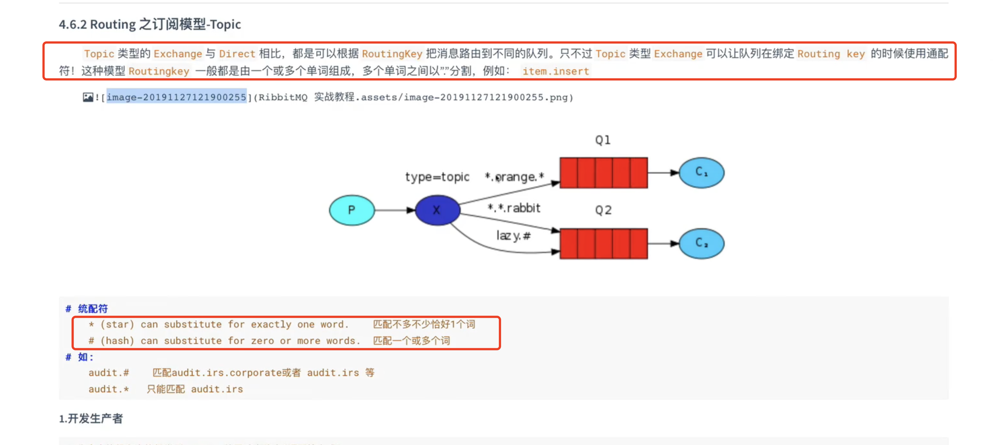
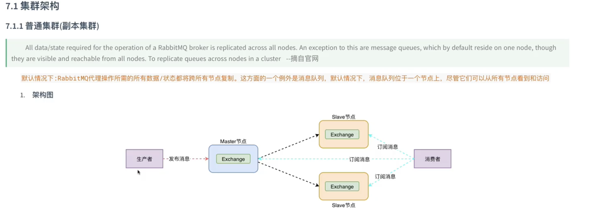
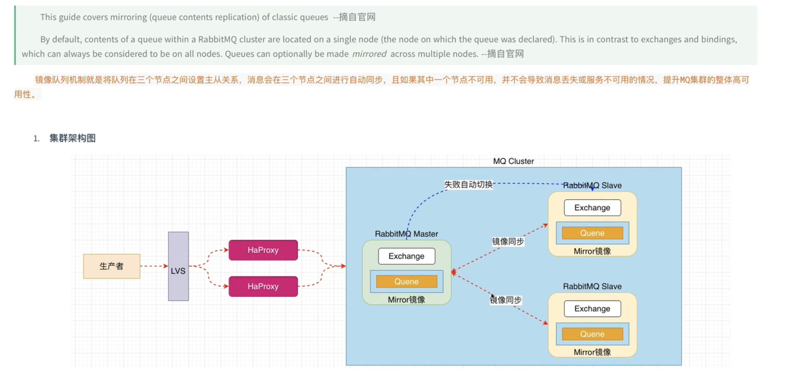

> RabbitMQ 专题
- https://www.bilibili.com/video/BV1dE411K7MG?from=search&seid=16139445668608499013
- [面试专题](https://daimajiaoliu.com/daima/4ed1488c1100414)

#### 引言
- 

##### AMQP,流程图
- 
- 
```text
虚拟主机(当成mysql库)
```

##### 简单操作安装
- $rabbitmqctl help

##### RabbitMQ 工作模式 (总共七种)
- [参考](https://www.rabbitmq.com/getstarted.html)
- 

```text
第一种：点对点，无交换机（默认用的交换机），一个队列，一个消费者
注：队列可设置持久化(Durable=true)，消息数据可设置持久化(PERSISTENT_TEXT_PLAIN). 生产者消费者参数必须严格对应

第二种：工作队列，无交换机（默认用的交换机），一个队列，多个消费者
消费者：这种是平均分配的（循环分配）。就会有快慢的问题，应该就能者多劳，autoAck设置为false 不会自动确让消息，设置通道每一次只能消费一个消息，
加手动确让

第三种：发布/订阅（fanout 广播），有交换机
- 有多个消费者
- 每个消费者都有自己的队列
- 每个队列都要绑定到交换机
- 生成者发送的消息，只能发送到交换机，交换机来决定要发给哪个队列，生成者无法决定
- 交换机把消息发送给绑定过的所有队列
- 队列的消费者都能拿到消息，实现一条消息被多个消费者消费 
- 没有路由key, 消费者创建临时队列消费

第四种：路由模型（Routing）
1, Routing之订阅模型-Direct(直连)  （如下图5）

第五种：动态路由匹配 Topic 
- （如下图6）
- 生产者代码 (图7)
- 消费者代码 (图8)

```
- 图5
- 图6
- Topic模式生产者代码
- Topic模式消费者代码


##### 应用场景
- 异步处理


- 应用结偶


- 流量削峰


##### RabbitMQ集群
- 普通集群（副本集群） 很少用到这种
```text
master只同步交换机的数据到备节点，不同步queue, 但是slave节点可以看到队列信息
slave 节点 就是master节点的一个备份， 不能进行故障转移

优点：当集群中某一时刻master节点宕机，可以对queue中信息，进行备份
```
主备模式

- 镜像集群 (金典集群)
```text
普通集群只同步交换机， 镜像集群可以同步交换机也可以同步队列
所有节点的queue的数据都是一样的
master宕机自动切换到slave节点
```
镜像集群架构图