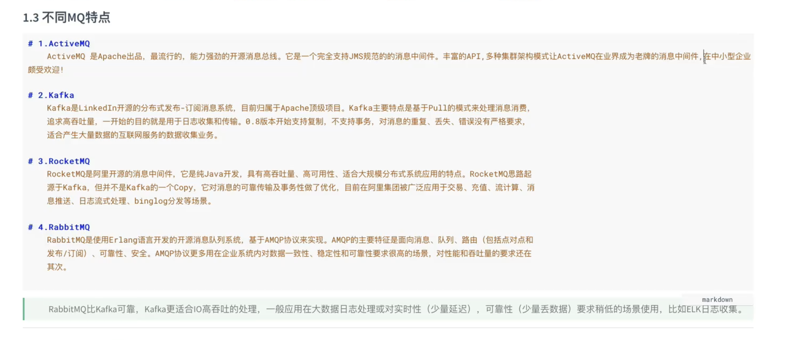
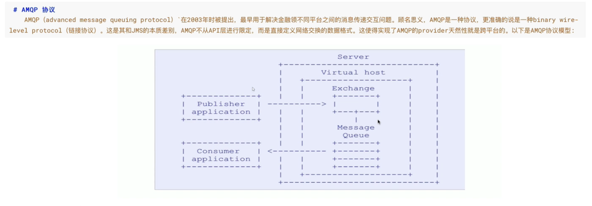
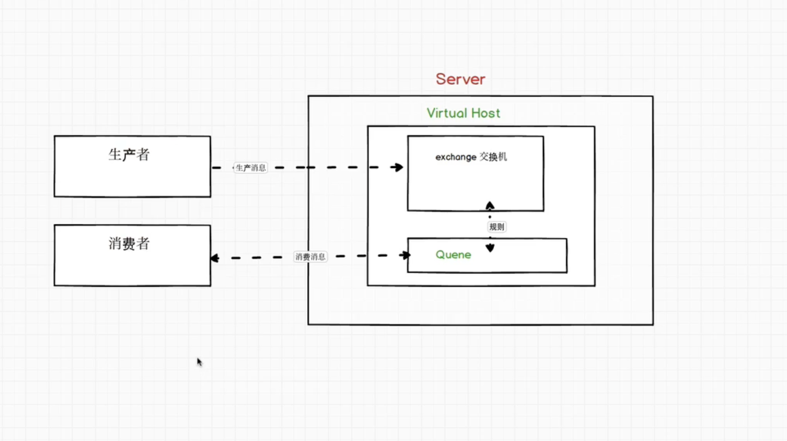

> RabbitMQ 专题
- https://www.bilibili.com/video/BV1dE411K7MG?from=search&seid=16139445668608499013

#### 引言
- 

##### AMQP,流程图
- 
- 
```text
虚拟主机(当成mysql库)
```

##### 简单操作安装
- $rabbitmqctl help

##### RabbitMQ 工作模式 (总共七种)
- [参考](https://www.rabbitmq.com/getstarted.html)
- 
```text
第一种：点对点，无交换机，一个队列，一个消费者
注：队列可设置持久化(Durable=true)，消息数据可设置持久化(PERSISTENT_TEXT_PLAIN). 生产者消费者参数必须严格对应

第二种：工作队列，无交换机，一个队列，多个消费者
消费者：这种是平均分配的（循环分配）。就会有快慢的问题，应该就能者多劳，autoAck设置为false 不会自动确让消息，设置通道每一次只能消费一个消息，
加手动确让


```