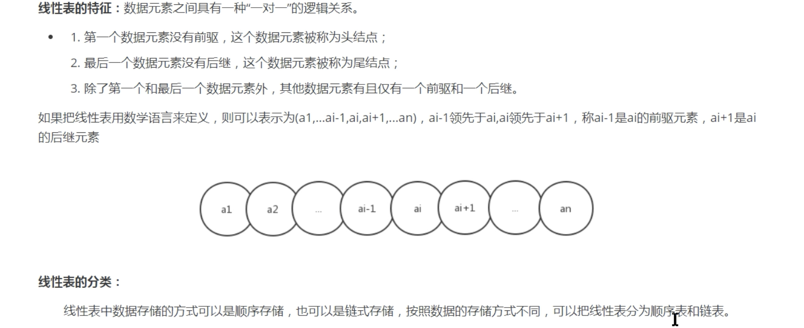
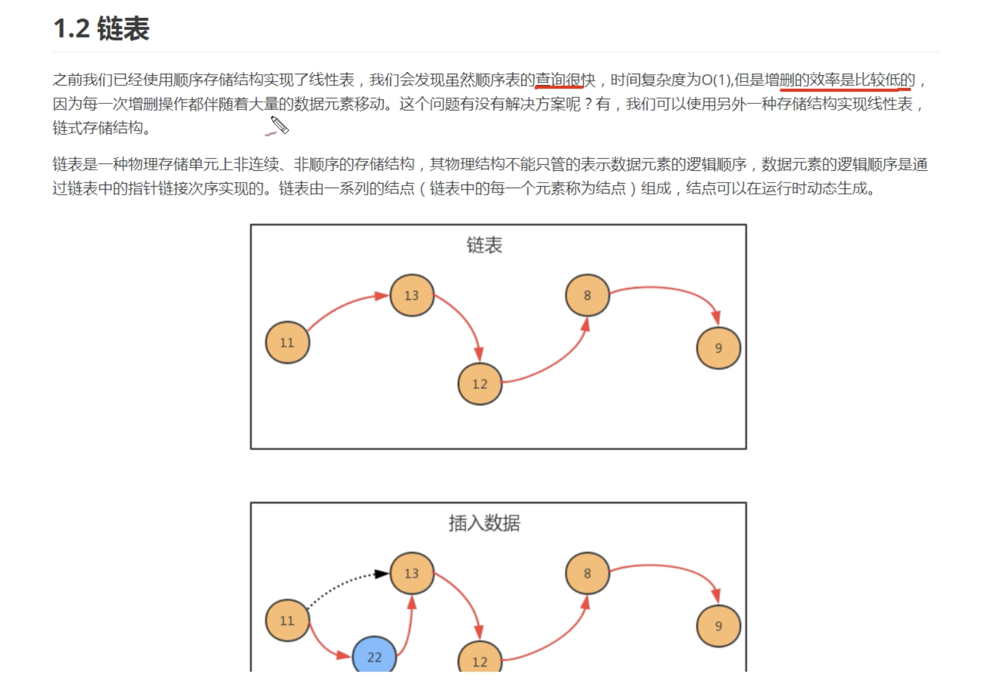
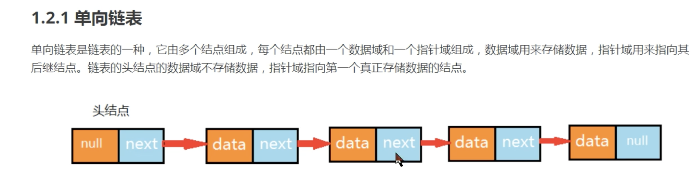
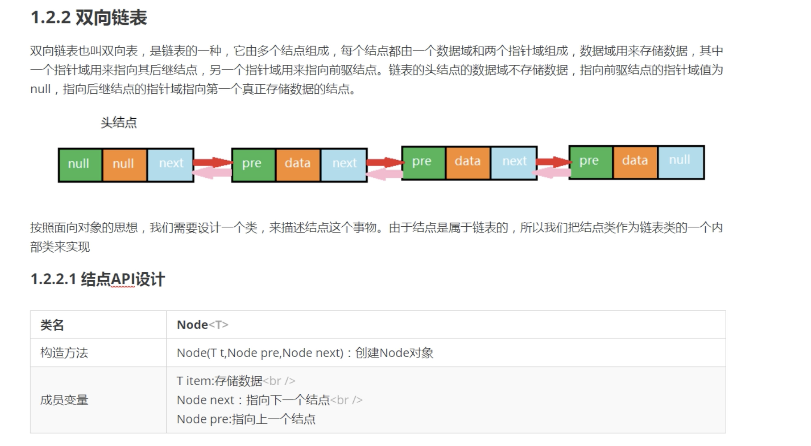

> 链表专题
- https://www.bilibili.com/video/BV1M7411f7aU?from=search&seid=32638455721249188

#### 线性表

```text
线性表的分类：
1，顺序存储 -> 顺序表 (数组)

2，链式存储 -> 链表
```

#### 线性表 -> 数组
```text
查询快O(1) 内存地址连续的，根据索引可以定位查找， 
增删慢O(N) 因为每一次增删操作都伴随大量的数据移动
```

#### 线性表 -> 链表






```text

```